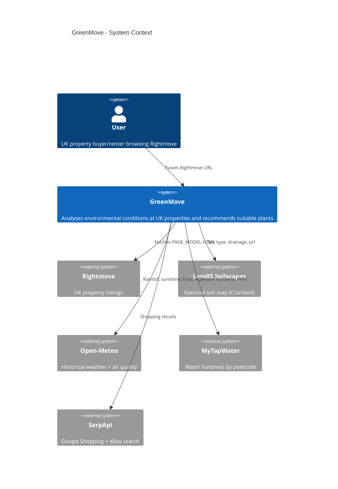
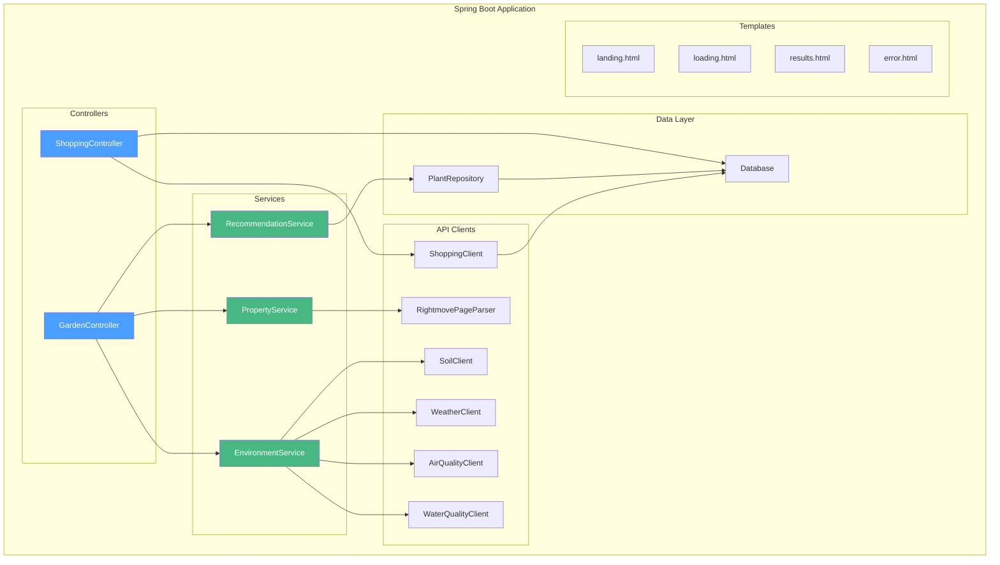
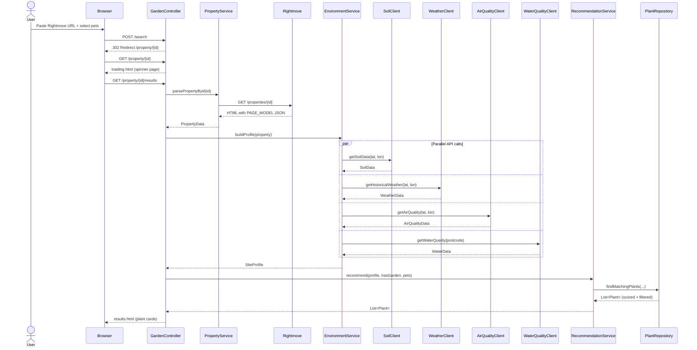
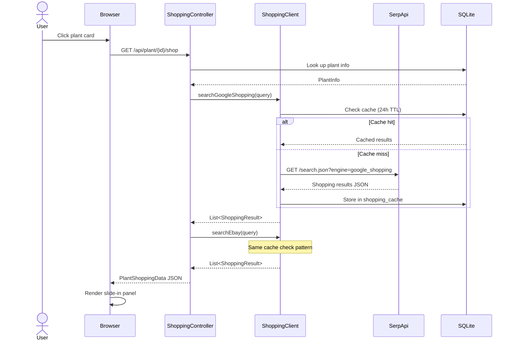
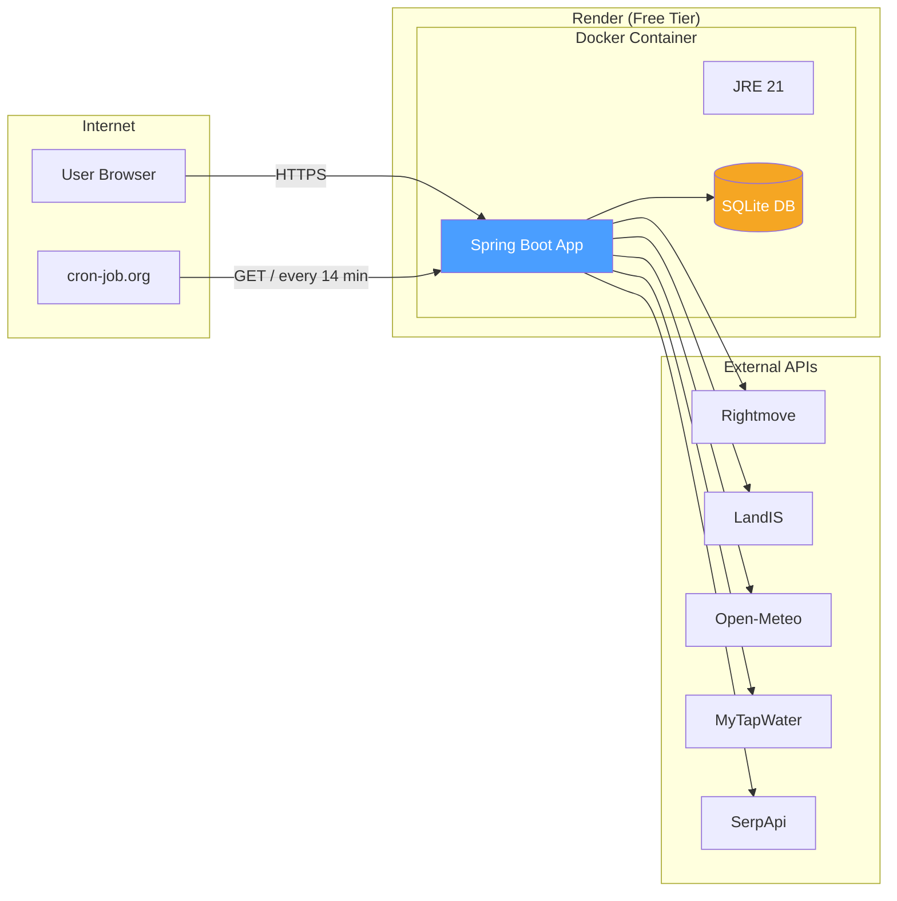

# Architecture

## System Context



## Component Diagram



## Request Flow: Property Analysis



## Request Flow: Shopping Panel



## Deployment Architecture



## Directory Structure

```
garden-planner/
  src/main/java/com/gardenplanner/
    api/
      AirQualityClient.java        # Open-Meteo air quality
      ShoppingClient.java           # SerpApi Google Shopping + eBay
      SoilClient.java               # LandIS Soilscapes
      WaterQualityClient.java       # MyTapWater/DEFRA
      WeatherClient.java            # Open-Meteo historical weather
    controller/
      GardenController.java         # Main page + property results
      ShoppingController.java       # REST API for shopping panel
    db/
      Database.java                 # Schema creation + seed data
      PlantRepository.java          # Plant queries + scoring
    model/
      Plant.java                    # Plant entity with scoring fields
      PlantShoppingData.java        # Shopping panel response DTO
      PropertyData.java             # Parsed Rightmove property
      RetailerLink.java             # Specialist retailer link
      ShoppingCategory.java         # Grouped shopping results
      ShoppingResult.java           # Normalised shopping item
      SiteProfile.java              # Environmental conditions
    rightmove/
      RightmovePageParser.java      # Rightmove HTML/JSON parser
    service/
      EnvironmentService.java       # Parallel API orchestration
      PropertyService.java          # Property fetching
      RecommendationService.java    # Plant recommendation entry point
  src/main/resources/
    templates/
      landing.html                  # Landing page
      loading.html                  # Loading spinner
      results.html                  # Plant results + shopping panel
      error.html                    # Error page
    static/css/
      style.css                     # All styles inc. shopping panel
    seed_plants.sql                 # Core plant + requirements data
    seed_gap_plants.sql             # Additional plants
    seed_toxicity.sql               # Pet toxicity data
    seed_images.sql                 # Wikipedia image URLs
    application.properties          # Config (excluded from git)
  docs/                             # This documentation vault
  Dockerfile                        # Multi-stage Docker build
  render.yaml                       # Render deployment blueprint
  build.gradle                      # Gradle build config
```
