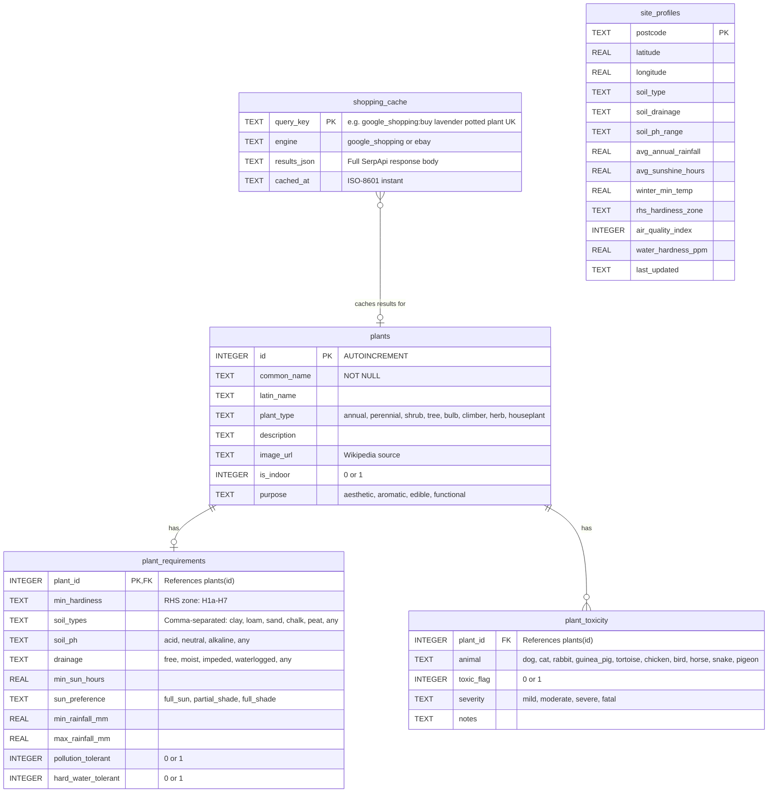
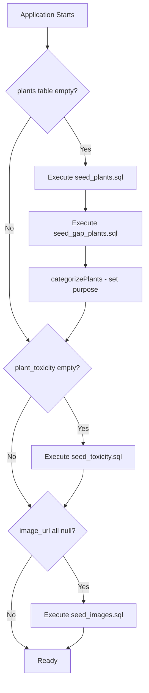

# Data Model

GreenMove uses SQLite with five tables, all created and seeded automatically on first startup by `Database.java`.

## Entity Relationship Diagram

## Table Details

### plants
The core plant catalogue. Seeded from `seed_plants.sql` (original set) and `seed_gap_plants.sql` (additional plants). Currently contains 96 plants. Images are populated separately via `seed_images.sql`.

`purpose` is set during seeding by `Database.categorizePlants()`:
- **aesthetic** (default) -- ornamental and visual appeal
- **aromatic** -- fragrant plants (lavender, jasmine, etc.)
- **edible** -- fruit, vegetables, herbs
- **functional** -- hedging, wildlife, screening, ground cover

### plant_requirements
One-to-one with `plants`. Defines the environmental conditions each plant needs. The [[04-scoring-algorithm]] compares these requirements against the `SiteProfile` to generate a suitability score.

### plant_toxicity
One-to-many with `plants`. Each row records whether a specific plant is toxic to a specific animal. Covers 10 pet types. Seeded from `seed_toxicity.sql`, sourced from ASPCA, RHS, Blue Cross, and species-specific veterinary databases.

### site_profiles
Stores environmental profiles by postcode. Currently created in the schema but not actively used for caching (identified as a [[09-future-features|future enhancement]]).

### shopping_cache
Caches raw SerpApi responses with a 24-hour TTL. The `query_key` includes the engine prefix (e.g. `google_shopping:buy lavender potted plant UK`) to namespace Google Shopping and eBay results. On Render's free tier, this cache is ephemeral and lost on redeployment.

## Seed Data Pipeline

