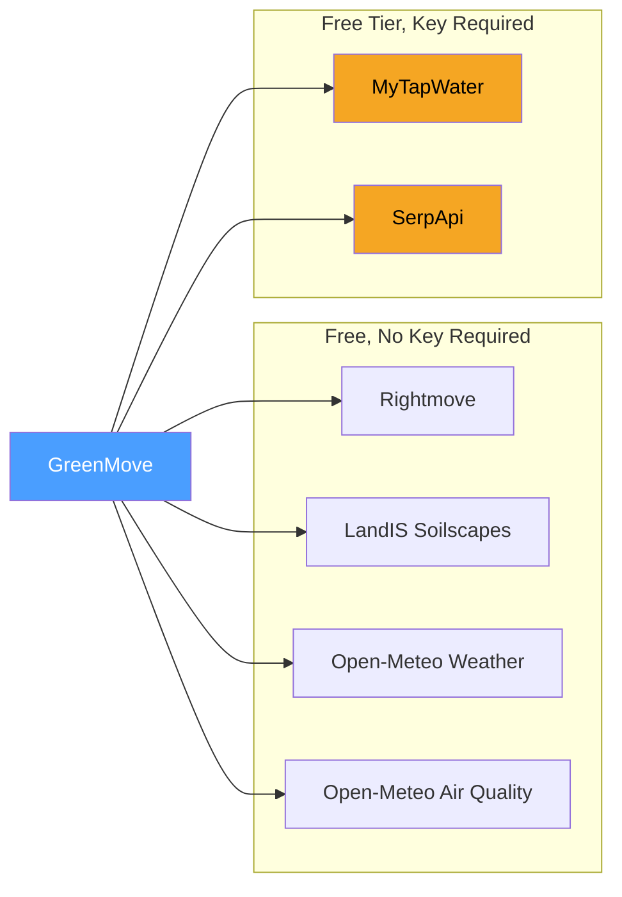

# External Dependencies

GreenMove integrates with five external data sources. All environmental APIs are free and require no API keys. Shopping APIs require an optional SerpApi key.

## Dependency Map

## Rightmove

| Property | Value |
|----------|-------|
| **Client** | `RightmovePageParser` |
| **Base URL** | `https://www.rightmove.co.uk/properties/{id}` |
| **Auth** | None |
| **Rate limit** | Informal -- no published limit, but aggressive scraping risks IP blocks |
| **Data returned** | Property coordinates, postcode, address, garden presence, bedrooms, type, images |

**How it works:** Fetches the full HTML page and extracts the `PAGE_MODEL` JavaScript object embedded in the page source. Supports two formats:
1. **Flat JSON** -- the `PAGE_MODEL` object is a standard JSON object
2. **Packed array** -- the `PAGE_MODEL` has a `data` field containing a JSON string that decodes to a flat array with integer references between elements, resolved recursively up to depth 5

**Garden detection:** Checks `keyFeatures` array and `text.description` for the word "garden".

**Fallback:** None. If Rightmove is unreachable or the page format changes, the request fails and an error page is shown.

---

## LandIS Soilscapes (Cranfield University)

| Property | Value |
|----------|-------|
| **Client** | `SoilClient` |
| **Base URL** | `https://www.landis.org.uk/arcgis/rest/services/UKSoilObservatory/Soilscapes_Cranfield/MapServer/identify` |
| **Auth** | None |
| **Rate limit** | No published limit |
| **Data returned** | Soilscape description text |

**How it works:** Sends a point query (lat/lon) to the ArcGIS REST endpoint. The `SOILSCAPE` attribute from the first result is parsed for keywords to derive:
- **Soil type:** clay, peat, chalk, sand, loam (default: loam)
- **Drainage:** free, impeded, waterlogged, moist (default: moist)
- **pH range:** acid, alkaline, neutral (default: neutral)

**Fallback:** Returns `SoilData("loam", "moist", "neutral")` on any error.

---

## Open-Meteo Historical Weather

| Property | Value |
|----------|-------|
| **Client** | `WeatherClient` |
| **Base URL** | `https://archive-api.open-meteo.com/v1/era5` |
| **Auth** | None |
| **Rate limit** | 10,000 requests/day (non-commercial) |
| **Data returned** | Daily precipitation, sunshine duration, min temperature |

**How it works:** Requests 4 years of daily weather data ending 1 month before today. Calculates:
- **Average annual rainfall** (mm) -- total precipitation / years
- **Average annual sunshine hours** -- total sunshine seconds / 3600 / years
- **Winter minimum temperature** (C) -- lowest recorded `temperature_2m_min`

The winter min temp is converted to an RHS hardiness zone by `EnvironmentService.getHardinessZone()`.

**Fallback:** Returns `WeatherData(750.0, 1400.0, -5.0)` on error (typical UK averages).

---

## Open-Meteo Air Quality

| Property | Value |
|----------|-------|
| **Client** | `AirQualityClient` |
| **Base URL** | `https://air-quality-api.open-meteo.com/v1/air-quality` |
| **Auth** | None |
| **Rate limit** | 10,000 requests/day (non-commercial) |
| **Data returned** | Hourly European AQI values |

**How it works:** Fetches current hourly European AQI data and averages all non-null readings.

AQI is described as:

| AQI Range | Description |
|-----------|-------------|
| 0-20 | Good |
| 21-40 | Fair |
| 41-60 | Moderate |
| 61-80 | Poor |
| > 80 | Very Poor |

**Fallback:** Returns `AirQualityData(25, "Fair")` on error.

---

## MyTapWater (DEFRA)

| Property | Value |
|----------|-------|
| **Client** | `WaterQualityClient` |
| **Auth** | Bearer token (`MYTAPWATER_API_KEY` env var) |
| **Rate limit** | ~100 requests/month (free tier) |
| **Data returned** | Water hardness in PPM |

**How it works:** Queries the MyTapWater API with a cleaned postcode (whitespace removed). Extracts the `hardness` field from the JSON response.

**Fallback chain:**
1. If no API key is configured: use postcode-based estimation
2. If HTTP 429 or 402 (quota exhausted): log a warning and use postcode-based estimation
3. If any other error: use postcode-based estimation

**Postcode-based estimation** groups UK postcodes into three hardness bands:
- **Hard water (~280 PPM):** South-East England, London, Home Counties (SE, SW, E, W, EC, WC, N, NW, CR, BR, DA, CT, ME, TN, BN, RH, KT, SM, SL, HP, LU, MK, OX, CB)
- **Soft water (~40 PPM):** North-West England, Merseyside, Greater Manchester (M, L, WA, CW, CH, WN, BL, OL, SK)
- **Soft water (~50 PPM):** Scotland (EH, G, DD, AB, IV, PH, FK, KY)
- **Default (~170 PPM):** All other postcodes

---

## SerpApi (Google Shopping + eBay)

| Property | Value |
|----------|-------|
| **Client** | `ShoppingClient` |
| **Base URL** | `https://serpapi.com/search.json` |
| **Auth** | API key query parameter (`SERPAPI_API_KEY` env var) |
| **Rate limit** | 100 searches/month (free tier) |
| **Engines used** | `google_shopping` and `ebay` |
| **Data returned** | Product listings with title, price, link, thumbnail, rating, reviews |

**How it works:** Two separate engines via the same API:

1. **Google Shopping** (`engine=google_shopping`): Searches for UK plant products. Returns `shopping_results` array. Both `link` and `product_link` fields from SerpApi are Google internal URLs that trigger GDPR consent pages for UK users, so `resolveGoogleShoppingLink()` maps the retailer source name to a direct merchant search URL (e.g. Amazon, Crocus, B&Q). Falls back to a Google web search if the source is unrecognised.

2. **eBay** (`engine=ebay`, `ebay_domain=ebay.co.uk`): Searches eBay UK. Returns `organic_results` array. Price and reviews are nested objects (`price.raw`, `price.extracted`, `reviews.rating`, `reviews.count`).

**Caching:** Results are cached in the `shopping_cache` SQLite table with a 24-hour TTL. Cache key format: `{engine}:{query}`.

**Fallback chain:**
1. If no API key is configured: `isApiAvailable()` returns false, only retailer links are shown
2. If HTTP 429 or 402 (quota exhausted): log a warning, return empty results, retailer links still available
3. If any other HTTP error: log a warning, return empty results
4. If exception: log a warning, return empty results

Retailer links (7 UK retailers) are always available with no API dependency.

## Dependency Health Summary

| Dependency | Key Required | Fallback | Impact of Failure |
|------------|-------------|----------|-------------------|
| Rightmove | No | None | **Fatal** -- cannot proceed without property data |
| LandIS Soilscapes | No | Defaults (loam/moist/neutral) | Degraded soil scoring |
| Open-Meteo Weather | No | Defaults (UK averages) | Degraded hardiness/rainfall scoring |
| Open-Meteo Air Quality | No | Defaults (AQI 25) | Degraded pollution scoring |
| MyTapWater | Yes (optional) | Postcode estimation | Less accurate water hardness |
| SerpApi | Yes (optional) | Retailer links only | No live shopping prices |
