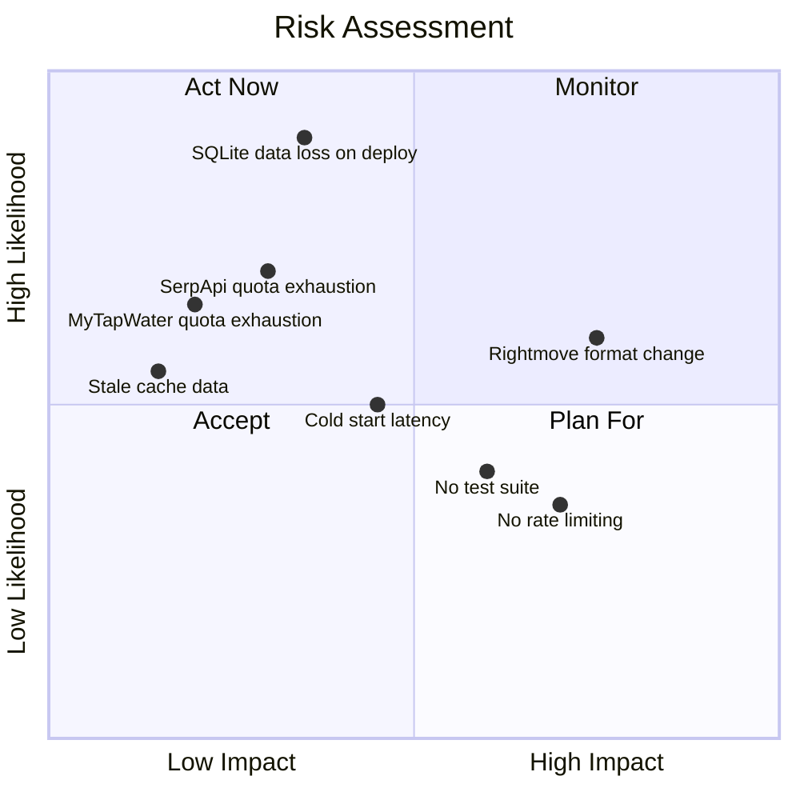

# Risks

## Risk Matrix

## Security Risks

### SEC-1: No Application-Level Rate Limiting

**Risk:** The application has no rate limiting. A malicious actor could exhaust API quotas (100 SerpApi searches/month, ~100 MyTapWater/month) or overwhelm the Render instance.

**Impact:** High -- API quotas exhausted for all users; potential service degradation.

**Likelihood:** Medium -- the app is publicly accessible but not widely known.

**Mitigation:** See [[09-future-features]] for planned rate limiting measures.

### SEC-2: Rightmove Scraping Without Permission

**Risk:** The application scrapes Rightmove property pages. This may violate Rightmove's terms of service. Rightmove could block the application's IP or take legal action.

**Impact:** High -- core functionality would break.

**Likelihood:** Low -- the application makes one request per user interaction, which is indistinguishable from normal browsing.

**Mitigation:** The application sets a browser-like `User-Agent` header. Request volume is naturally limited by user interaction. No bulk scraping is performed.

### SEC-3: API Keys in Environment Variables

**Risk:** API keys for SerpApi and MyTapWater are stored as Render environment variables. If the Render account is compromised, keys are exposed.

**Impact:** Medium -- keys could be used to exhaust quotas.

**Likelihood:** Low -- Render accounts are protected by standard authentication.

**Mitigation:** Keys are not stored in source code (`.gitignore` exclusion). Both services support key rotation.

## Performance Risks

### PERF-1: Render Free Tier Cold Starts

**Risk:** Render's free tier spins down containers after 15 minutes of inactivity. Cold starts take ~30 seconds as the JVM boots and the database is seeded.

**Impact:** Medium -- first user after an idle period sees a long loading screen.

**Likelihood:** Medium -- mitigated by cron-job.org ping every 14 minutes, but cron failures would allow spin-down.

**Mitigation:** cron-job.org keep-alive ping. If the cron job fails, the app still works but with cold start delays.

### PERF-2: No Connection Pooling

**Risk:** Every database query opens a new `DriverManager.getConnection()` call to SQLite. Under concurrent load, this could become a bottleneck.

**Impact:** Low -- SQLite connections are lightweight and the app sees minimal concurrent traffic.

**Likelihood:** Low at current scale.

**Mitigation:** Planned migration to HikariCP. See [[09-future-features]].

### PERF-3: N+1 Toxicity Query

**Risk:** `PlantRepository.findMatchingPlants()` executes one toxicity query per plant in the result set (up to 96 queries). This is an N+1 query pattern.

**Impact:** Low -- SQLite is fast for simple queries and the total data volume is small.

**Likelihood:** Certain -- this happens on every request.

**Mitigation:** Planned batch query optimisation. See [[09-future-features]].

### PERF-4: No HTTP Timeouts on External API Calls

**Risk:** All external HTTP calls use `HttpClient` with no explicit connect or read timeouts. A hung upstream API could block a Tomcat thread indefinitely.

**Impact:** High -- under sustained upstream failure, all Tomcat threads could be exhausted.

**Likelihood:** Low -- public APIs rarely hang indefinitely.

**Mitigation:** Planned timeout configuration. See [[09-future-features]].

## Operational Risks

### OPS-1: SQLite Data Loss on Redeployment

**Risk:** Render's free tier uses an ephemeral filesystem. The SQLite database (including the shopping cache) is destroyed on every deployment.

**Impact:** Low -- plant data is re-seeded automatically. Shopping cache is rebuilt as users interact.

**Likelihood:** Certain -- happens on every deploy.

**Mitigation:** Plant and toxicity data is seeded from SQL files on startup. Shopping cache rebuilds organically. For persistent data, migration to PostgreSQL is planned. See [[09-future-features]].

### OPS-2: No Monitoring or Health Checks

**Risk:** There is no uptime monitoring, health endpoint, or alerting. If the app goes down, there is no automatic notification.

**Impact:** Medium -- users see errors with no explanation; operator is unaware.

**Likelihood:** Medium -- Render's free tier can be unreliable.

**Mitigation:** Planned Spring Boot Actuator integration and external monitoring. See [[09-future-features]].

### OPS-3: No Logging Aggregation

**Risk:** Application logs are only available via the Render dashboard. No structured logging, no log aggregation service.

**Impact:** Low -- debugging production issues requires manual log inspection.

**Likelihood:** N/A -- this is a permanent state until addressed.

**Mitigation:** Acceptable for a personal project. If traffic grows, consider a free log aggregation tier (e.g. Papertrail, Better Stack).

## Reliability Risks

### REL-1: Rightmove PAGE_MODEL Format Changes

**Risk:** Rightmove can change their page structure at any time. The packed array format (with integer references) was a recent change that required reverse-engineering. Future changes could break parsing silently.

**Impact:** High -- all property analysis would fail.

**Likelihood:** Medium -- Rightmove regularly updates their frontend.

**Mitigation:** The parser supports both flat and packed formats. Planned automated smoke tests against known property IDs would detect format changes early. See [[09-future-features]].

### REL-2: Environmental API Default Fallbacks Silently Degrade Quality

**Risk:** When environmental APIs fail, the app silently falls back to default values. Users see results but don't know the data is estimated rather than measured.

**Impact:** Medium -- recommendations may be less accurate without the user's knowledge.

**Likelihood:** Low -- the free APIs are generally reliable.

**Mitigation:** Planned graceful degradation indicators to show users which data points are estimated. See [[09-future-features]].

### REL-3: No Test Suite

**Risk:** There are no automated tests. Changes to the scoring algorithm, Rightmove parser, or plant data could introduce regressions without detection.

**Impact:** High -- silent correctness bugs in plant recommendations.

**Likelihood:** Medium -- any code change could introduce a regression.

**Mitigation:** Planned test suite covering scoring algorithm, Rightmove parser, soil parsing, and pet toxicity filtering. See [[09-future-features]].
