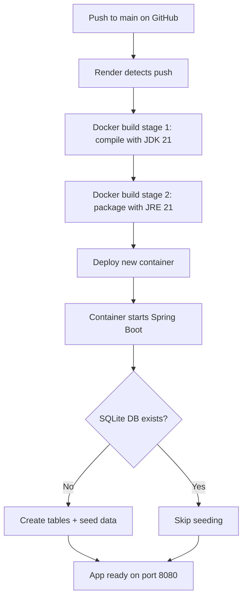

# Deployment

GreenMove is hosted on Render's free tier using a Docker deployment.

## Hosted Instance

**URL:** `https://greenmove-k7zm.onrender.com`

## Render Configuration

### render.yaml

The repository includes a Render blueprint at the project root:

```yaml
services:
  - type: web
    name: greenmove
    runtime: docker
    dockerfilePath: ./Dockerfile
    plan: free
    envVars:
      - key: MYTAPWATER_API_KEY
        sync: false
      - key: SERPAPI_API_KEY
        sync: false
```

### Docker Build

The `Dockerfile` uses a multi-stage build:

```
Stage 1: eclipse-temurin:21-jdk
  - Copies source and Gradle wrapper
  - Runs ./gradlew bootJar
  - Produces build/libs/*.jar

Stage 2: eclipse-temurin:21-jre
  - Copies the jar from stage 1
  - Exposes port 8080
  - Runs java -jar app.jar
```

### Environment Variables

Set these in the Render dashboard under **Environment**:

| Variable | Required | Description |
|----------|----------|-------------|
| `SERPAPI_API_KEY` | No | SerpApi key for Google Shopping and eBay results. Without it, the shopping panel shows only retailer links. |
| `MYTAPWATER_API_KEY` | No | MyTapWater API key for accurate water hardness data. Without it, the app falls back to postcode-based estimation. |

Spring Boot reads these via `@Value("${serpapi.api.key:}")` and `@Value("${mytapwater.api-key:}")` annotations. The empty defaults mean the app starts and functions without either key.

## Keep-Alive Ping

Render's free tier spins down the container after 15 minutes of inactivity. To prevent cold starts, a cron job is configured on **cron-job.org**:

| Setting | Value |
|---------|-------|
| URL | `https://greenmove-k7zm.onrender.com` |
| Schedule | Every 14 minutes |
| Method | GET |
| Timeout | 30 seconds |

This keeps the container warm at the cost of one trivial HTTP request every 14 minutes.

## Deployment Workflow



**Important:** Because Render's free tier uses an ephemeral filesystem, the SQLite database is recreated on every deployment. This means:
- Plant catalogue data is re-seeded automatically (no data loss)
- Shopping cache is cleared (results rebuild organically as users interact)
- The `site_profiles` table starts empty

## Running Locally

```bash
./gradlew bootRun
```

The app starts at `http://localhost:8080`. No environment variables are required -- the app uses fallback behaviour for missing API keys.

To enable shopping results and accurate water data locally, create `src/main/resources/application.properties`:

```properties
serpapi.api.key=your-serpapi-key-here
mytapwater.api-key=your-mytapwater-key-here
```

This file is excluded from git via `.gitignore`.

## Building the Docker Image Locally

```bash
docker build -t greenmove .
docker run -p 8080:8080 \
  -e SERPAPI_API_KEY=your-key \
  -e MYTAPWATER_API_KEY=your-key \
  greenmove
```
